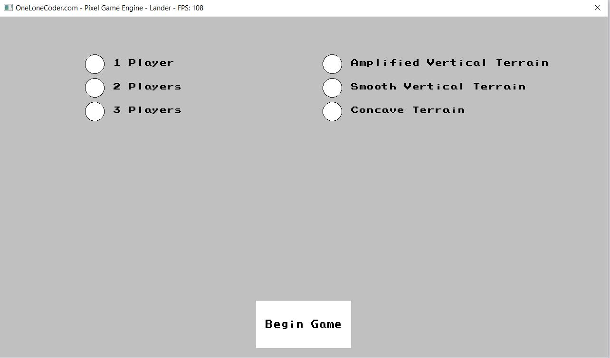
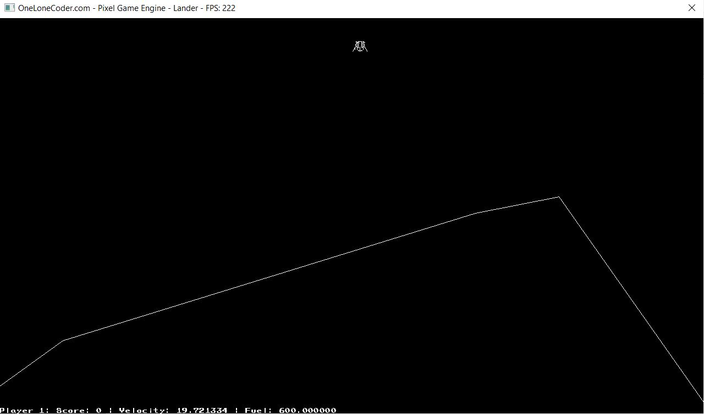
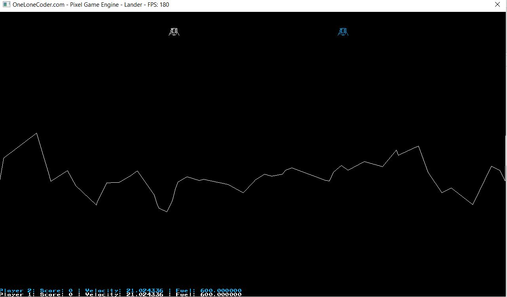
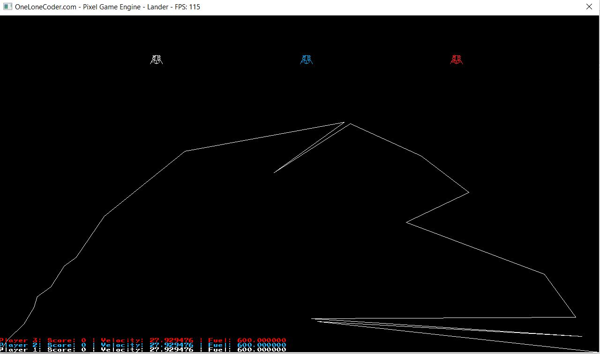

# Lander
This is an implementation of the famous game [Lander](http://moonlander.seb.ly/). The project uses the [Pixel Game Engine](https://github.com/OneLoneCoder/olcPixelGameEngine) and one of its extensions to do the graphical side of things.

## Gameplay
The game features local multiplayer and mutliple terrain types. They go as follows:

- Amplified vertical terrain - simple random height map
- Smooth vertical terrain - Perlin noise height map
- Concave terrain - non self-intersecting curve

| | |
|--|--|
|  |  | 
|  |  | 

# Running the project locally
In order to generate project files for Visual Studio you can run `premake5 vs2019`. It is not advisable to generate project files for other IDEs apart from Visual Studio, since Pixel Game Engine does not work there out of the box.
